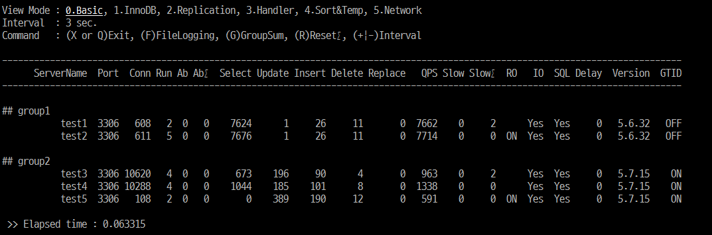
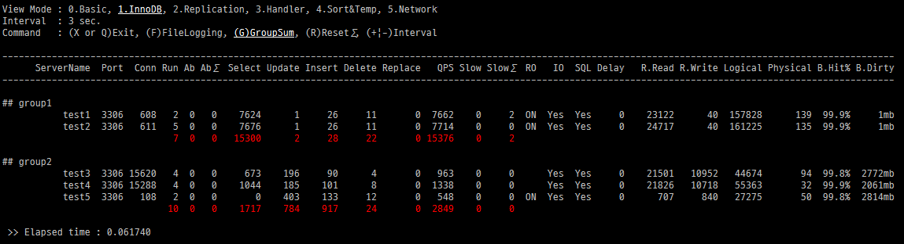
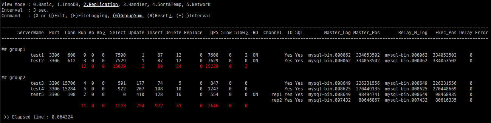

Watchtower (for MySQL)
======================

### Watchtower
Watchtower is a python application designed for monitoring multiple mysql instances. 

### Requirements
- Python
- Python/MySQLdb
```
$ yum install MySQL-python
```

### Usage
#### 1) Create server list file.
Server list file is a CSV file that contains group name, hostname, mysql port. See "example.txt".
```
$ cat example.txt
group1,test1,3306
group1,test2,3306
group2,test3,3307
group2,test4,3307
```
#### 2) Create a MySQL user account 
````
GRANT REPLICATION CLIENT ON *.*  to {USER}@{MONITOR_SERVER_IP} IDENTIFIED BY '{PASSWORD}';
````
#### 3) Run watchtower
````
$ python watchtower.py serverlist.txt
MySQL Username : ****
MySQL Password : ****
````

or, You can use hard-coded id/password. (line #14 ~ 16)
````
14 # Global Variable
15 MySQL_User="****"
16 MySQL_Pass="****"
````

### Screenshots
#### Basic Mode

#### InnoDB Mode

#### Replication Mode

